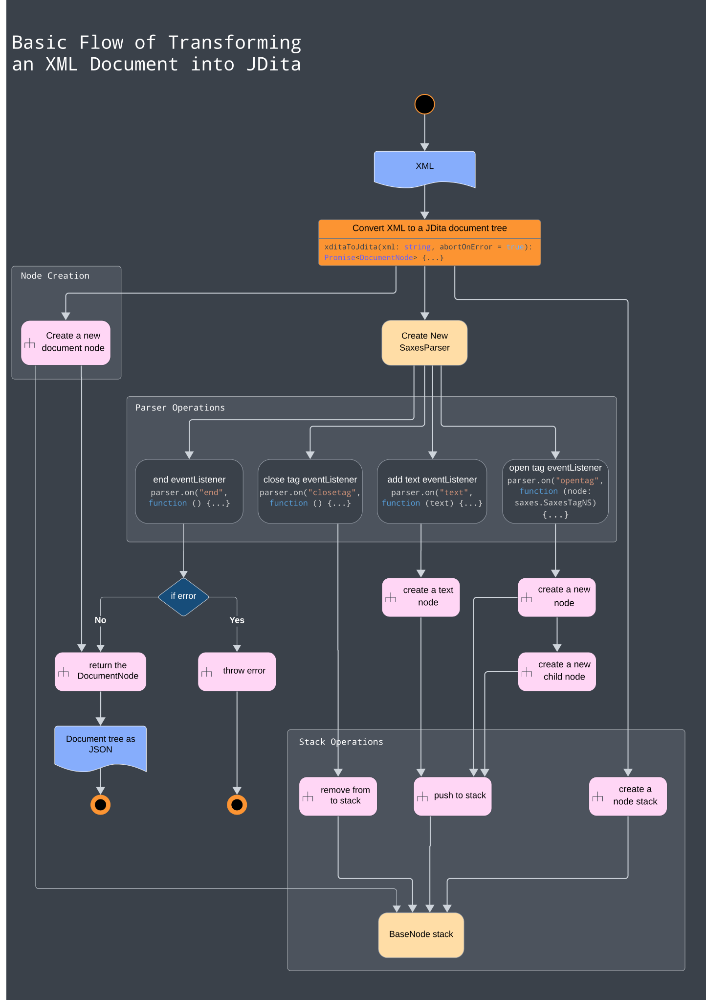

# JDita

[](https://nodejs.org)
[](https://circleci.com/gh/evolvedbinary/jdita)
[](https://coveralls.io/github/evolvedbinary/jdita?branch=main)

This tool generates JSON data from XDita files.

---

## Usage

You can add JDita to your project using `npm` or `yarn`

```bash
npm install --save @evolvedbinary/lwdita-xdita
```

or

```bash
yarn add @evolvedbinary/lwdita-xdita
```

### Basic example

```javascript
import { xditaToJson, xditaToJdita, serializeToXML } from "./converter";
import { BaseNode, TextNode, TopicNode } from "@evolvedbinary/lwdita-ast/nodes";
import { storeOutputXML } from "./utils";

const xml = `
<?xml version="1.0" encoding="UTF-8"?>
<!DOCTYPE topic PUBLIC "-//OASIS//DTD LIGHTWEIGHT DITA Topic//EN" "lw-topic.dtd">
<topic>...</topic>
`
xditaToJdita(xml)
.then(result => {
  console.log(JSON.stringify(result.json, null, 2));
 })
.catch(e => console.log('Failed to convert:', e));
```

By default, `xditaToJson` will fail when it encounters any error (XML syntax errors, validation errors,...).
If you want to ignore any errors and work with whatever data the function could collect, set the second argument `abortOnError` to `false`:

```javascript
xditaToJson(xml, false)
```

### Serialization of the JDita AST to XML

The full example with an additional option for serializing the JDita object back into XML can be found in file [example.ts](packages/lwdita-xdita/example.ts).

The serialization function contains an option for indenting the output with 2 spaces according to the level of the node tag level and adding a newline after each tag.
This is handled by the second parameter of `serializeToXML(root, indent)`.
When set the second parameter to false, the output will be generated in one line.
The generated XML will contain all XML nodes, their text content, and their attributes (`CDATA` is currently not processed).

```javascript
serializeToXML(result, true)
```

And in context:

```javascript
xditaToJdita(xml)
  .then(result => {
    console.log(JSON.stringify(result.json, null, 2));
    const res = serializeToXML(result, true).join('');
  })
  .catch(e => console.log('Failed to convert:', e));
```

If you want to store the XML output in a file, you can see an example in [example.ts](packages/lwdita-xdita/example.ts).

## Development

### Prerequisites

For development, you will need Node.js and a node package manager to be installed in your environment.

* Minimal Node version: v20.1.0
* [Yarn](https://classic.yarnpkg.com/) version v1.22.21.
* Optional: This project uses Yarn as its build system. Although we don't support it, if you prefer, it should also be possible to use `npm` instead of `yarn`.

### Installation

Clone the JDita repository:

```shell
git clone https://github.com/evolvedbinary/jdita.git
```

Change to the JDita directory:

```shell
cd jdita
```

Install all packages:

```shell
yarn install
```

### Packages

This project uses [Yarn workspaces](https://classic.yarnpkg.com/en/docs/workspaces).
The current packages, aka. "workspaces" are `lwdita-xdita` and `lwdita-xdita` and can be found in folder `packages/`.
Package `lwdita-xdita` contains all files and modules for parsing an xml document.
Package `lwdita-ast` contains all files and modules for creating the abstract syntax tree ("AST") of the parsed XML document, provided by package `lwdita-xdita`.

Both packages depend on each other, as indicated by the `dependency` in their respective package.json files, and they share the same global node modules and commands as declared in the `package.json` file in the root of the project.

If in the future different node modules or commands should be defined for the packages, then you are able to address the packages directly with command

```shell
yarn workspace <workspace_name> <command>
```

In the global package.json you can e.g. define specific commands for each package like following pattern:

```json
"scripts": {
  "start:package-a": "yarn workspace package-a start",
  "start:package-b": "yarn workspace package-b start"
}
```

To get more information about contained workspaces, run command

```shell
yarn workspaces info
```

### Build

To build the project, run:

```shell
yarn run build
```

This will create a `./lib` folder in the root of each sub-module, which contains binaries that can be copied to your own project.

### Generate the TSDoc Documentation

You can generate the documentation by running

```shell
yarn run generate-docs
```

This will generate a new folder `docs` containing an HTML file with the entire TSDoc JDita documentation.
Open this file in a browser to navigate through the documentation.

### Test

This project also has tests which are written using the Mocha framework.
To execute the test suite and view the code coverage, run:

```shell
yarn run test
yarn run coverage
```

### Example

We have an example file to test the conversion: `example.ts`.
This file contains a small example in `XDITA` format.

If you want to test this library and its conversion from `XDITA` to `JDITA`, run:

```shell
yarn run example
```

## How JDita Works

JDita takes in documents in LwDITA XDITA (XML) format, and produces an AST (Abstract Syntax Tree).

XDITA is the LwDITA authoring format that uses XML to structure information. LwDITA is a subset of DITA, with new multimedia element types added to support interoperability with HTML5.
[Source: https://www.dita-ot.org/4.1/topics/lwdita-input](https://www.dita-ot.org/4.1/topics/lwdita-input)

The conversion process starts by building a tree whose root node represents the XDITA Document Node, then appending each XDITA Element Node as a child node node in the tree.

This will generate a full document tree that represents the original XDITA document as a JavaScript object.



Here's how the nodes are created:


Examples of the nodes `<title>` and `<topic>`:

