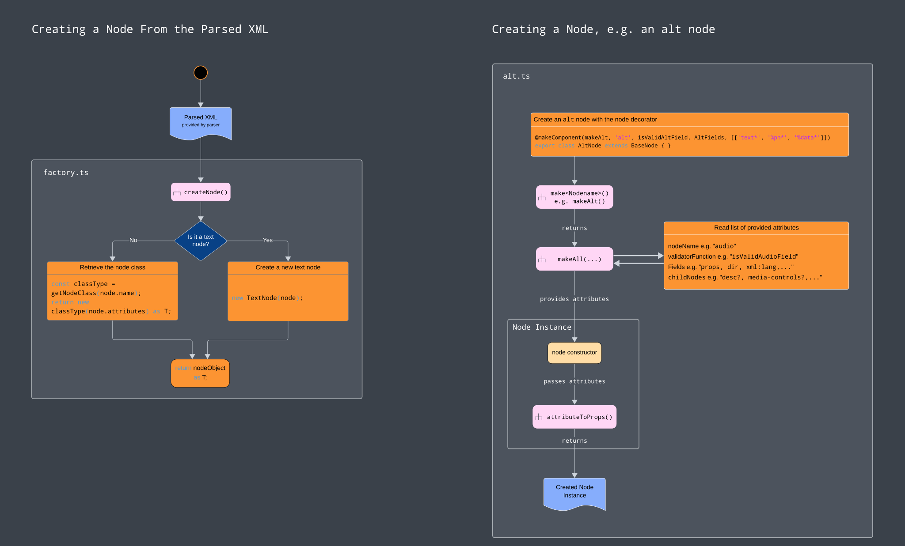
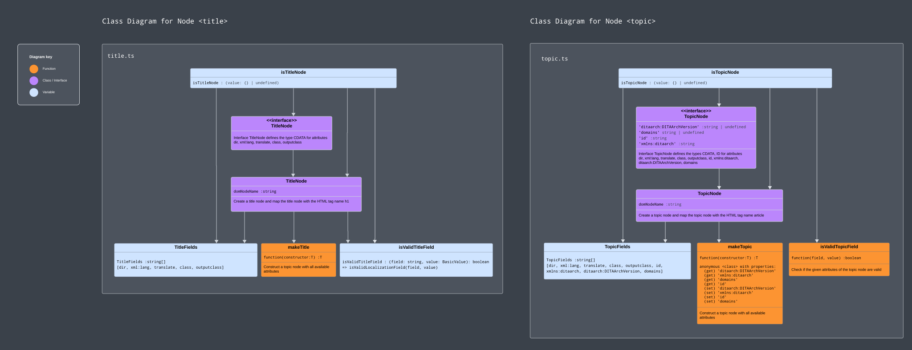

# LwDITA

[](https://nodejs.org)
[](https://circleci.com/gh/evolvedbinary/lwdita)
[](https://coveralls.io/github/evolvedbinary/lwdita?branch=main)

This repository contains a number of tools and libraries for working with LwDITA (Lightweight DITA):
1. lwdita-xdita
  A parser and serializer for XDITA (which is the XML representation of LwDITA). This can serialize/deserialize XDITA to an lwdita-ast object tree.
2. lwdita-ast
  An object representation of the LwDITA conceptual model. This is used by lwdita-xdita.

---

## Working with XDITA

You can add lwdita-xml library to your project using `npm` or `yarn`

```bash
npm install --save @evolvedbinary/lwdita-xdita
```

or

```bash
yarn add @evolvedbinary/lwdita-xdita
```

### XDITA Parsing Example

The following example code shows how to parse XDITA to an lwdita-ast object tree.

```javascript
import { xditaToAst, astToJdita } from "@evolvedbinary/lwdita-xdita/converter";

const xdita = `
<?xml version="1.0" encoding="UTF-8"?>
<!DOCTYPE topic PUBLIC "-//OASIS//DTD LIGHTWEIGHT DITA Topic//EN" "lw-topic.dtd">
<topic>...</topic>
`

const abortOnError = true;

xditaToAst(xdita, abortOnError)
  .then(ast => console.log(JSON.stringify(ast.json, null, 2))
  .catch(e => console.log('Failed to convert:', e));
```

As `abortOnError` is set to `true` above, `xditaToAst` will fail when it encounters any error (XML syntax errors, validation errors, etc.). If instead you want to ignore any errors and work with whatever data the function could collect, `abortOnError` to `false` instead.

#### Experimental JDita Model
If you would prefer a simpler object model than the lwdita-ast to work with, we have an experimental object model called JDita. To use this, you can pass the output of `xditaToAst` through the experimental converter function `astToJdita`. Note that this API is subject to change! For example:

```javascript
xditaToAst(xdita, abortOnError)
  .then(ast => astToJdita(ast))
  .then(jdita => console.log(JSON.stringify(jdita.json, null, 2))
  .catch(e => console.log('Failed to convert:', e));
```

### XDITA Serialization Example

A full example with an additional option for serializing the AST object back into XML can be found in the file [example.ts](packages/lwdita-xdita/example.ts).

```javascript
import { InMemoryTextSimpleOutputStreamCollector, XditaSerializer } from "@evolvedbinary/lwdita-xdita/xdita-serializer";

const indentXmlOutput = true;
const indentation = '\t';
const indentationSize = 1;

const outputStream = new InMemoryTextSimpleOutputStreamCollector();
const serializer = new XditaSerializer(outputStream, indentXmlOutput, indentation, indentationSize);
const xdita = serializer.serialize(ast);

console.log(xdita);
```

* You can replace `InMemoryTextSimpleOutputStreamCollector` with your own OutputStream implementation by implementing the interface `SimpleOutputStream`.

* The serialized XML will faithfully contain all XML node types apart from `CDATA` nodes which are currently unsupported.


## Development

### Prerequisites

For development, you will need Node.js and a node package manager to be installed in your environment.

* Minimal Node version: v20.1.0
* [Yarn](https://yarnpkg.com/) version v4.2.2.
* Optional: This project uses Yarn as its build system. Although we don't support it, if you prefer, it should also be possible to use `npm` instead of `yarn`.

### Installation

Clone the lwdita repository:

```shell
git clone https://github.com/evolvedbinary/lwdita.git
```

Change to the lwdita directory:

```shell
cd lwdita
```

Install all packages:

```shell
yarn install
```

### Packages

This project uses [Yarn workspaces](https://classic.yarnpkg.com/en/docs/workspaces).
The current packages, aka. "workspaces" are `lwdita-xdita` and `lwdita-ast` and can be found in folder `packages/`.

Package `lwdita-xdita` contains all files and modules for parsing and serializing XDITA documents.
Package `lwdita-ast` contains all files and modules for creating the AST (Abstract Syntax Tree) of the parsed document, provided by package `lwdita-xdita`.

Both packages depend on each other, as indicated by the `dependency` in their respective package.json files, and they share the same global node modules and commands as declared in the `package.json` file in the root of the project.

If in the future different node modules or commands should be defined for the packages, then you are able to address the packages directly with command

```shell
yarn workspace <workspace_name> <command>
```

In the global package.json you can e.g. define specific commands for each package like following pattern:

```json
"scripts": {
  "start:package-a": "yarn workspace package-a start",
  "start:package-b": "yarn workspace package-b start"
}
```

To get more information about contained workspaces, run command

```shell
yarn workspaces info
```

### Build

To build the project, run:

```shell
yarn run build
```

This will create a `./dist` folder in the root of each sub-module, which contains binaries that can be copied to your own project.

### Generate the TSDoc Documentation

You can generate the documentation by running

```shell
yarn run generate-docs
```

This will generate a new folder `docs` containing an HTML file with the entire TSDoc lwdita documentation.
Open this file in a browser to navigate through the documentation.

### Test

This project also has tests which are written using the Mocha framework.
To execute the test suite and view the code coverage, run:

```shell
yarn run test
yarn run coverage
```

### Example

We have an example file to test the conversion: `example.ts`.
This file contains a small example in `XDITA` format.

If you want to test this library and its conversion from `XDITA` to `JDita`, run:

```shell
yarn run example
```

## How it Works

lwdita-xdita takes in documents in LwDITA XDITA (XML) format, and produces an AST (Abstract Syntax Tree).

XDITA is the LwDITA representation that uses XML to structure information. LwDITA is a subset of DITA, with new multimedia element types added to support interoperability with HTML5.
[Source: https://www.dita-ot.org/4.1/topics/lwdita-input](https://www.dita-ot.org/4.1/topics/lwdita-input)

The conversion process starts by building a tree whose root node represents the XDITA Document Node, then appending each XDITA Element Node as a child node node in the tree.

This will generate a full document tree that represents the original XDITA document as a JavaScript object.


Here's how the nodes are created:



Examples of the nodes `<title>` and `<topic>`:



# Contributing
## Create a release
If you want to create a new release of lwdita please follow these instructions:

```shell
# change the working directory to the package root
cd packages/lwdita-xdita  # or packages/lwdita-ast when working on the AST package 
```
Ensure your package version is updated, Yarn uses semantic versioning, this will also create a new tag with the version number and commit it, you can update your package version using:
```shell
# please pick the best option for your scenario
yarn version --patch    # for bug fixes
yarn version --minor    # for new features
yarn version --major    # for breaking changes

git push --tags  # to commit your new version change
```
Publish the package:
```shell
yarn publish --access public
# you will be prompted to login via a url and a password
```